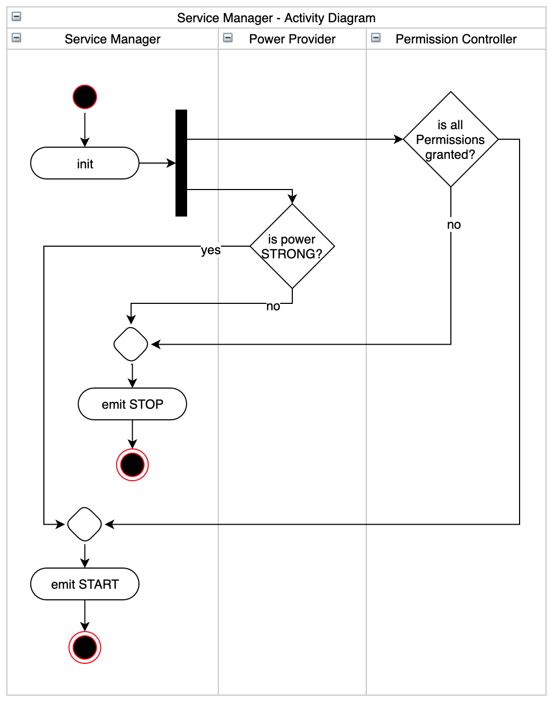

# Ad Stream Practice

AdStream is an application that helps Driver/Place Owner monetizate by running Advertisement in tablet, display panel or TV.

## Top-level Folder Structure

```
.
├── bin
│   └── run_build_runner.sh   # A script to re-generate depencency injection code if needs.
└── packages
    ├── ad_stream             # Flutter App
    └── vendor
        ├── inject            # Compile-time depencency injection library, contains number of patch fixes
        └── inject_generator  # due to the pending maintenance of the original packges.
```

## Design of Service Manager Component

Activity Diagram



Class Diagram


